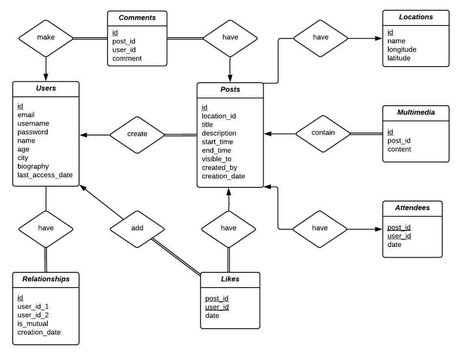
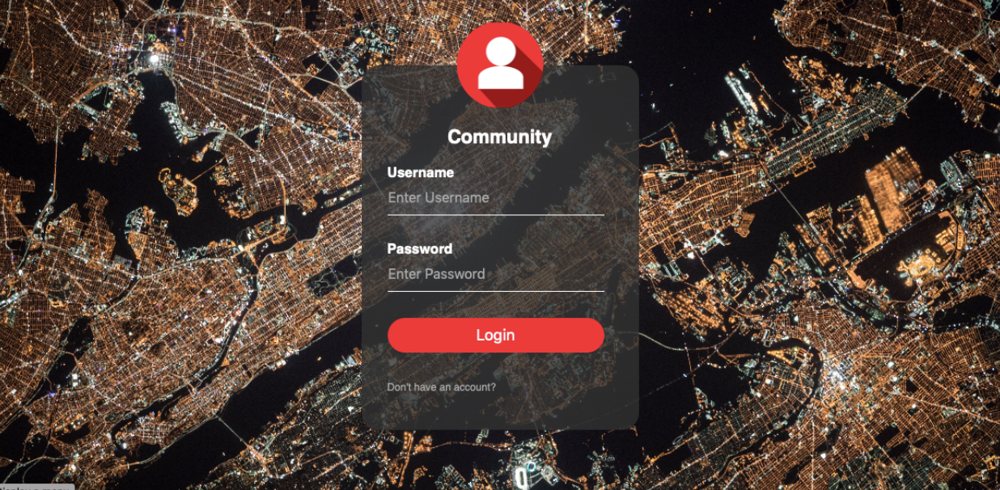
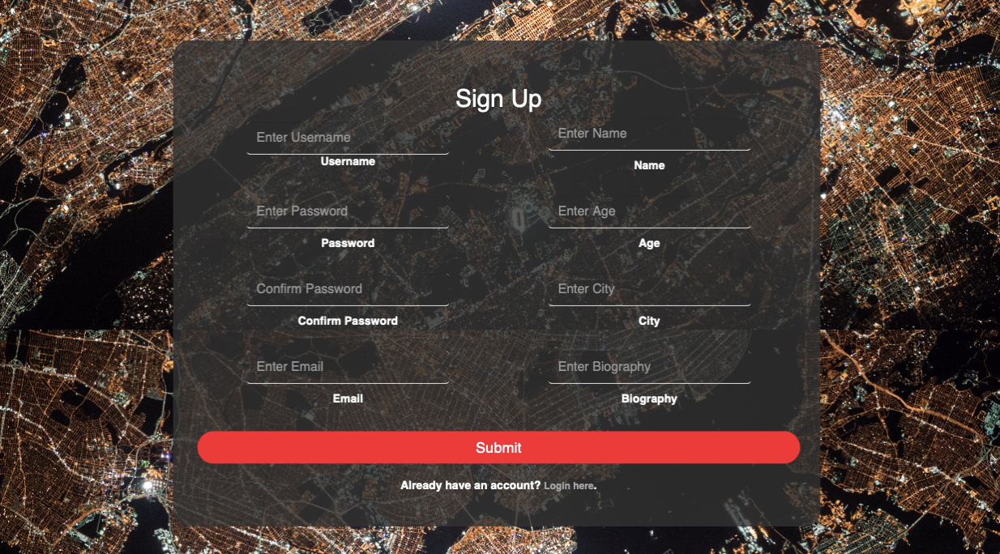
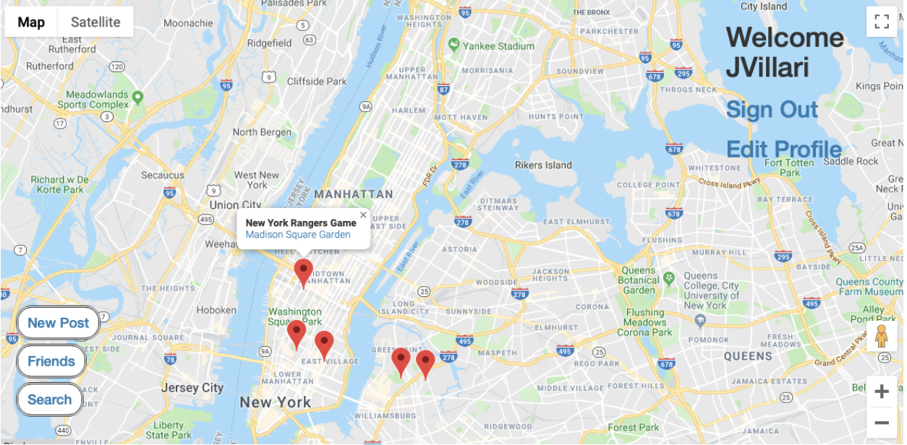

# Community

---

A location-based social media site showing local events going on within a user's radius. The purpose of Community is to connect people in the same surrounding area who are interested in going to the same place at the same time. When a user navigates to the page, a map of their on their home city appears with markers on any events that are currently going on. Users can click on these events to learn more about them, view any associated uploaded multimedia, comment and/or read other user comments, and like or dislike the post. The events are posted by users themselves who are looking for other users interested in attending the same event. Some examples of events include concerts, sports games, dance clubs, bars, and even movies or restaurants. This will provide people in the same community with a better way to meet people with shared interests.

---

## Functional Description

The first page the user encounters when they visit the Community website is the login page (index.php). If they are not already a user, they can click “Don’t have an account?” which bring them to register.php where they can create an account and add some information about themselves. Once they have created an account, they can sign in through the login page. Then their own personal homepage will be displayed (home.php). The entire screen is an interactive map (built using the Google Map API) with public postings displayed in the area. From their homepage, they can explore the events around them by clicking on each of the markers and travel to the event details page (viewEvent.php). On this page, depending on the privacy settings of the post, if it is public or they are friends with the poster they can see the name of the event, the description, the start time, the end time, any uploaded images, the popularity of the post (likes and dislikes), and the user comments. They can also like or dislike the post as well as post their own comments. The users are also able to create their own event postings from their homepage by clicking on the “New Post” button (navigating them to the newEvent.php page). From here they enter their event name, location, description, start time, end time, visibility, and any associated multimedia. Once they click create event, a marker will be dropped on the map with the associated link that provides the event details.

From their homepage, a user is also able to manage their friends by clicking on the “Friends” button (friends.php). On the friends page, they can request a friend via their username, accept/deny any active friend requests, and view all their current friends. Once returning to their homepage, a user can also search all posts for keywords that they may be interested in (search.php). The results return both the name and link to the post. Finally, a user can view and edit their profile (profile.php) and logout of the system (logout.php) on their homepage. Some additional features include map and satellite views, street-views, geocoding, and zoom controls.

---

## Technologies used

- PHP
- MySQL
- HTML
- CSS
- JavaScript
- XML
- Google Maps API

---

## Relationship Diagram

---

## Sign-In

---

## Sign-Up

---

## Home Page

